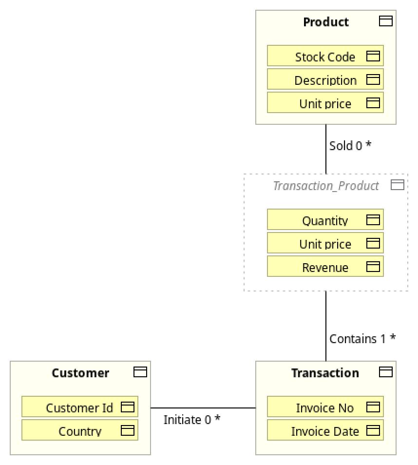
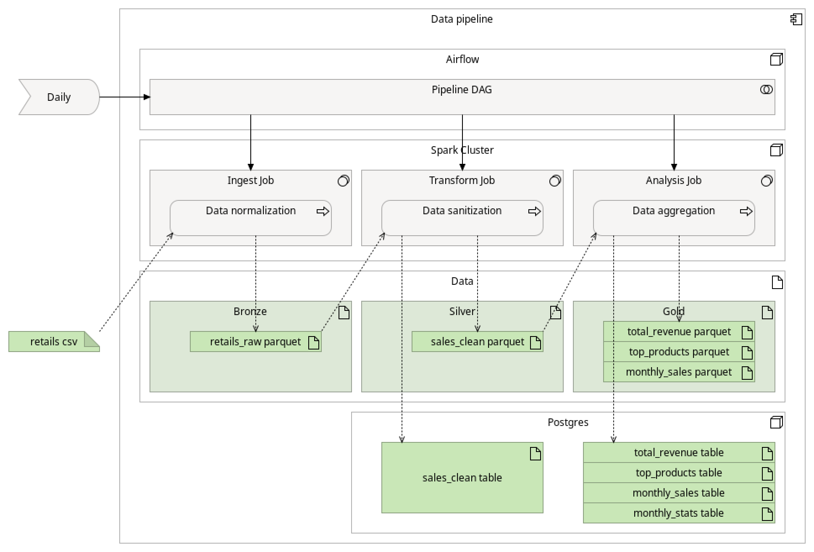

# End-to-End Data Pipeline Implementation

**Online Retail Case**

Medallion pipeline (bronze → silver → gold) with **PostgreSQL**, **Spark**, and **Airflow** on Docker Compose. Source dataset: `data/retails.csv`.

**Bonus — AI insights agent:** the [`ai/`](ai/) directory adds an optional LangGraph agent for natural-language questions over the warehouse (`sales_clean` and gold tables), with a YAML semantic layer, read-only SQL tools, and an optional **RAG** layer backed by **pgvector** in the same Postgres instance (`public.rag_chunks`). Airflow **`rag_index_pipeline`** refreshes reports and re-indexes after each medallion run. See [`ai/README.md`](ai/README.md) and [`ai/rag/README.md`](ai/rag/README.md). Quick start once the pipeline has run and Postgres is up:

```bash
cd ai
python3.12 -m venv .venv && source .venv/bin/activate
pip install -e ".[dev]"
cp .env.example .env   # set LLM_API_KEY
insights ask "What is the total revenue?"
insights chat          # interactive session with conversation memory
```

## Architecture

The views in [`docs/`](docs/) are drawn with **[ArchiMate](https://www.opengroup.org/archimate)** (The Open Group Architecture Framework modeling language): a **business** view of the retail domain and a **structure** view of how the pipeline is implemented.

### Business object view

Customers place transactions (invoices); each transaction has one or more product lines. The ArchiMate business-object view captures that domain model.



| Business object | Attributes in the diagram | Columns in `retails.csv` |
|-----------------|---------------------------|---------------------------|
| **Customer** | `CustomerId`, `Country` | `CustomerID`, `Country` |
| **Transaction** | `InvoiceNo`, `InvoiceDate` | `InvoiceNo`, `InvoiceDate` |
| **Product** | `StockCode`, `Description`, `Unit price` | `StockCode`, `Description`, `UnitPrice` |
| **Transaction_Product** | `Quantity`, `Unit price`, `Revenue` | `Quantity`, `UnitPrice`, `Revenue` |

The source file is a **denormalized export**: one row is one **Transaction_Product** line, with customer, invoice, and product attributes repeated. The pipeline does not materialize four separate PostgreSQL tables; after cleaning, data lives at line-item grain in `public.sales_clean` (silver), which aligns with the associative object in the diagram.

**Relationships (cardinality):**
- Customer → Transaction: `0..*` (a customer may have zero or many invoices).
- Transaction → Transaction_Product: `1..*` (each invoice has at least one line).
- Product → Transaction_Product: `0..*` (a product may appear on many lines).

### Data pipeline structure view

End-to-end flow from source file to analytics, orchestrated on a Docker Compose stack (PostgreSQL, Spark standalone cluster, Airflow).



| Layer / component | Role |
|-------------------|------|
| **Source** | `data/retails.csv` (Online Retail line items) |
| **Bronze** | `spark/jobs/ingest.py` → `data/bronze/retails_raw/` (raw Parquet, minimal change) |
| **Silver** | `spark/jobs/transform.py` → `data/silver/retails_clean/` and `public.sales_clean` (cleaned, PII-hashed) |
| **Gold** | `spark/jobs/analysis.py` → `data/gold/retails_analysis/` and Postgres tables (`total_revenue`, `top_products`, `monthly_sales`, `monthly_stats`) |
| **SQL analysis** | `postgres/queries/analysis.sql` on `sales_clean` (complementary to PySpark gold outputs) |
| **Orchestration** | **`sales_medallion_pipeline`**: ingest → transform → analysis (`SparkSubmitOperator`); then triggers **`rag_index_pipeline`** |
| **RAG batch** | `generate_reports.py` → `data/rag/docs/`; `index.py` → `public.rag_chunks` (pgvector init: `postgres/init/create_pgvector_db.sql`) |
| **Runtime** | Docker Compose: Postgres (`pgvector/pgvector:pg16`), Spark master/worker, Airflow webserver and scheduler |

**Required job order:** ingest → transform → analysis. Spark job details: [`spark/README.md`](spark/README.md).

## Prerequisites

- Docker Engine and Docker Compose v2
- Approximately 8 GB of available RAM
- `data/retails.csv` present in the repository

## 1. Build and start the stack

From the project root, run:

```bash
docker compose build
docker compose up -d
```

**On the first run:**

- **Postgres** (`pgvector/pgvector:pg16`) executes scripts in `postgres/init/`:
  - `create_airflow_db.sql` — Airflow metadata database
  - `create_pgvector_db.sql` — `vector` extension and `public.rag_chunks` table for the RAG layer
- **`airflow-init`** runs once (`airflow db migrate` and admin user creation), then exits.
- The other services remain active: Postgres, Spark master and worker, Airflow webserver and scheduler.

Verify that Postgres is healthy and that `airflow-init` has completed successfully:

```bash
docker compose ps
```

| Service | URL / access |
|---------|----------------|
| Airflow UI | http://localhost:8088 (`admin` / `admin`) |
| Spark UI | http://localhost:8080 |
| PostgreSQL | `localhost:5432` (`postgres` / `postgres`, database `pipeline`; includes pgvector) |

## 2. Run the pipeline (Spark)

Submit jobs from the `pipeline-spark-master` container. The repository is mounted at `/opt/pipeline` inside the containers.

**Ingest** (CSV to bronze Parquet):

```bash
docker exec pipeline-spark-master spark-submit \
  --master spark://spark-master:7077 \
  --name ingest-retails \
  /opt/pipeline/spark/jobs/ingest.py
```

**Transform** (data cleaning, PII hashing, silver Parquet and `public.sales_clean`):

```bash
docker exec pipeline-spark-master spark-submit \
  --master spark://spark-master:7077 \
  --name transform-clean-data \
  --packages org.postgresql:postgresql:42.7.3 \
  /opt/pipeline/spark/jobs/transform.py
```

**Analysis** (`spark/jobs/analysis.py`, PySpark questions from the exercise):

```bash
docker exec pipeline-spark-master spark-submit \
  --master spark://spark-master:7077 \
  --name analysis-retails \
  --packages org.postgresql:postgresql:42.7.3 \
  /opt/pipeline/spark/jobs/analysis.py
```

The analysis job addresses the three PySpark requirements:

| Exercise question | Implementation | Postgres table | Driver logs |
|-------------------|----------------|----------------|-------------|
| **What is the total revenue generated in the dataset?** | `sum(revenue)` | `public.total_revenue` | Result printed at job completion |
| **Which are the top 10 most popular products based on the quantity sold?** | Group by product, order by `total_quantity`, `limit(10)` | `public.top_products` | Top 10 displayed with `.show(10)` |
| **What is the monthly revenue trend? Provide insights into any noticeable patterns or anomalies.** | Monthly revenue and summary statistics | `public.monthly_sales`, `public.monthly_stats` | Monthly breakdown and aggregate stats |

**Required execution order:** ingest → transform → analysis.

## 3. Run SQL analysis

Execute after `transform` has populated `sales_clean`:

```bash
docker exec -i pipeline-postgres psql -U postgres -d pipeline < postgres/queries/analysis.sql
```

## 4. Validate Postgres (warehouse + pgvector)

**List business and vector tables:**

```bash
docker exec -it pipeline-postgres psql -U postgres -d pipeline -c "\dt public.*"
```

You should see medallion tables (`sales_clean`, gold tables) and, from init, `rag_chunks` (empty until indexing — Airflow **`rag_index_pipeline`** or manual `python rag/jobs/index.py`; see [`ai/rag/README.md`](ai/rag/README.md)).

**Verify pgvector:**

```bash
docker exec -it pipeline-postgres psql -U postgres -d pipeline -c "\dx vector"
docker exec -it pipeline-postgres psql -U postgres -d pipeline -c "\d public.rag_chunks"
```

## 5. Validate the results

**Verify the cleaned dataset** (loaded by `transform.py`):

```bash
docker exec -it pipeline-postgres psql -U postgres -d pipeline -c \
  "SELECT COUNT(*) AS sales_clean_rows FROM public.sales_clean;"
```

**PySpark exercise answers** (available after `analysis.py`):

**What is the total revenue generated in the dataset?**

```bash
docker exec -it pipeline-postgres psql -U postgres -d pipeline -c \
  "SELECT * FROM public.total_revenue;"
```

**Which are the top 10 most popular products based on the quantity sold?**

```bash
docker exec -it pipeline-postgres psql -U postgres -d pipeline -c \
  "SELECT * FROM public.top_products ORDER BY total_quantity DESC;"
```

**What is the monthly revenue trend? Provide insights into any noticeable patterns or anomalies.**

```bash
docker exec -it pipeline-postgres psql -U postgres -d pipeline -c \
  "SELECT TO_CHAR(sale_month, 'YYYY-MM') AS month,
          invoices_count, revenue, items_sold
   FROM public.monthly_sales
   ORDER BY sale_month;"
```

Note: `sale_month` is stored as a timestamp by Spark. `TO_CHAR` is used here for readable output only.

**Insights** (cleaned data, Jan 2010–Dec 2011 — same window as `analysis.py`):

**Patterns**
- **Two phases:** tiny revenue through most of 2010 (£4k–£17k, few invoices), then ~£848k from December onward.
- **Wholesale rhythm:** steady state is roughly £840k–£980k/month with ~100 invoices — big baskets (~350 lines each), not retail seasonality.
- **2011 peak:** inches up and tops out around £981k in August; nothing dramatic after that.

**Anomalies**
- **Dec 2010 step change:** ~140× jump from November (£6k → £848k). I'd treat Jan–Nov 2010 as ramp-up, not a normal baseline.
- **Incomplete Dec 2011:** only looks weak (~£252k) because the file stops on the 11th — partial month.
- **May 2010 low:** floor at £4.4k (5 invoices), probably sparse data at the start of the extract.
- **Mean vs median:** mean and std dev sit close together because of early low months and the December jump. Median (~£547k) is a more honest typical month once you ignore the ramp-up.

**Summary statistics** (also available in `public.monthly_stats` and in the analysis job logs):

```bash
docker exec -it pipeline-postgres psql -U postgres -d pipeline -c \
  "SELECT * FROM public.monthly_stats;"
```

Rough totals: ~£10.98M over 24 months; peak Aug 2011, low May 2010.

**Expected output directories on the host:**

- `data/bronze/retails_raw/`: raw Parquet files
- `data/silver/retails_clean/`: cleaned Parquet files
- `data/gold/retails_analysis/`: analytical Parquet outputs
- `data/rag/docs/`: RAG markdown reports (written by Airflow; gitignored)

## 6. Airflow (orchestration)

Two DAGs — details in [`airflow/README.md`](airflow/README.md):

| DAG | Schedule | Flow |
|-----|----------|------|
| **`sales_medallion_pipeline`** | `@daily` | ingest → transform → analysis → trigger RAG |
| **`rag_index_pipeline`** | triggered / manual | generate reports → index pgvector |

1. Open http://localhost:8088 (`admin` / `admin`).
2. Enable **both DAGs**.
3. Trigger **`sales_medallion_pipeline`** (or wait for `@daily`). After Spark analysis, it starts **`rag_index_pipeline`**.

**RAG tasks** ([`airflow/dags/rag_pipeline.py`](airflow/dags/rag_pipeline.py)):

- `generate_rag_reports` — SQL fingerprint → rewrite `.md` in **`data/rag/docs/`** when the warehouse changed
- `index_rag_docs` — chunk + embed → `public.rag_chunks` (requires **`LLM_API_KEY`** in `ai/.env` or Airflow Variable)

Airflow runs as uid **50000** (same as Spark). It writes RAG output under **`data/rag/`**, not **`ai/rag/docs/`** (host-owned reference corpus for local dev).

**SQL analysis** (`postgres/queries/analysis.sql`) is not in either DAG — run manually after `transform` (step 3).

## Reset the environment

Stop all services and remove the Postgres volume (this clears business data and Airflow metadata):

```bash
docker compose down -v
```

Then repeat from **step 1**. The `airflow-init` service will run again on the next `docker compose up`.

## Troubleshooting

| Issue | Resolution |
|-------|------------|
| `ClassNotFoundException: org.postgresql.Driver` | Include `--packages org.postgresql:postgresql:42.7.3` for transform and analysis jobs |
| JDBC connection refused from Spark | Run jobs inside Docker (`pipeline-spark-master`); jobs default to `POSTGRES_HOST=postgres`. Override only if you run Spark outside Compose |
| Permission errors on `airflow/logs` (SELinux) | Volume mounts use the `:z` flag; ensure the directory exists: `mkdir -p airflow/logs` |
| `airflow-init` already completed | Expected on restart; the admin user is recreated only after `docker compose down -v` |
| `extension "vector" is not available` / Postgres unhealthy on first boot | Use `pgvector/pgvector:pg16` in `docker-compose.yml` (not plain `postgres:16`), then `docker compose down -v && docker compose up -d` |
| `pipeline-postgres` unhealthy after adding `create_pgvector_db.sql` | Init scripts run only on a fresh volume; reset with `docker compose down -v` after fixing the Postgres image |
| Task `up_for_retry` / `Unable to clear output directory` | Parquet owned by another uid (e.g. old Spark runs as 1001). Reset: `docker exec -u root pipeline-spark-master rm -rf /opt/pipeline/data/bronze /opt/pipeline/data/silver /opt/pipeline/data/gold`, then **Clear** + **Trigger DAG**. Spark containers use `user: "50000:0"` to match Airflow |
| `PermissionError` on `ai/rag/docs/` from Airflow | Expected — RAG batch writes to **`data/rag/docs/`** via `RAG_DOCS_DIR` in the RAG DAG |
| `OpenAIError: Missing credentials` on `index_rag_docs` | Set `LLM_API_KEY` in `ai/.env` (mounted at `/opt/pipeline/ai/.env`) or `docker exec pipeline-airflow-scheduler airflow variables set LLM_API_KEY '…'` |
